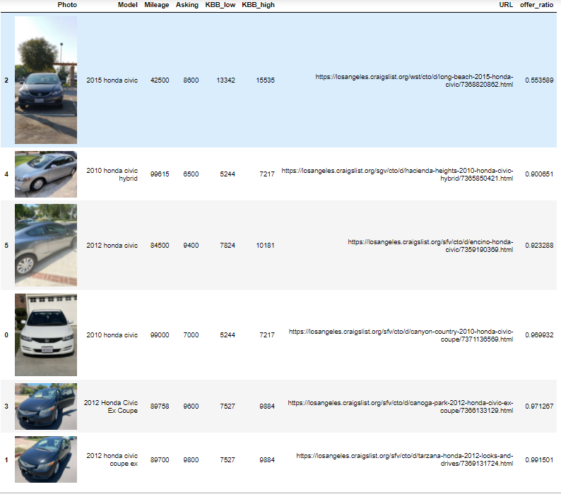

# CarScrape
My girlfriend is looking to buy a new car.

So I made a craigslist scraper that checks the posted cost against Kelly Blue Book's estimate and then emails a table of the results to my girlfriend.
It only records and sends 'good' deals. 

Good deals are found when the ratio between the CL posted asking price divided by the low end of the KBB recommeneded listing price is less than 1. 

